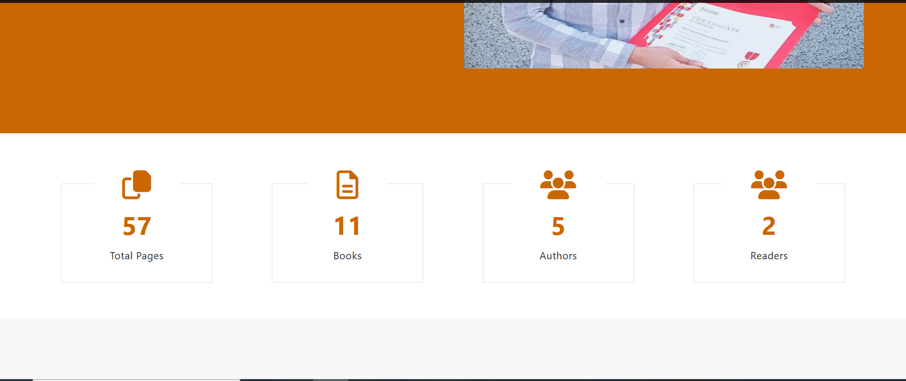

# Getting Started with  Author Book app

[](https://www.youtube.com/watch?v=Sr8g3lMEy4E)
<br/>
<br/>

<br>
<br>

<br>
<br>

<br>
<br>


# Book Author Front

Welcome to My React Project! This is a brief guide on how to set up and run the project locally.

## Prerequisites

Before getting started, make sure you have the following software installed on your machine:

- Node.js (version 12 or higher)
- npm (Node Package Manager)

## Installation

1. Clone the repository to your local machine:

   ```bash
   git clone https://github.com/M7moud-Hassan/book_author_front.git

2. run the follow command:

   ```bash
   npm i
3. run the follow command:

   ```bash
   npm start
